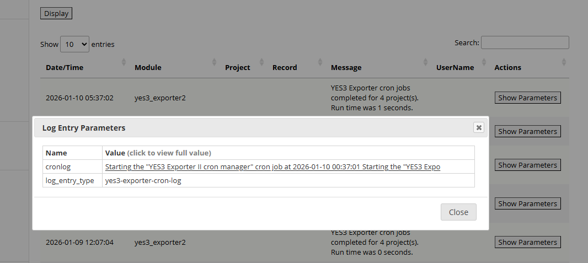

# The EM Log Parameter Viewer (EMLPV)

## The problem addressed

REDCap's built in EM Log browser is very powerful, but it will truncate the displayed value of EM Log Parameters. This is reasonable since these values can be extremely large. However, there are times when viewing the full content is desirable.

## What it does

EM Log Parameter Viewer enhances REDCap's built-in EM Log browser by allowing you to display the full content of any em log parameter.

The EMLPV is enabled on Control Center, which will provide access to all EM logs for all projects. You may also enable the EM for any project.

### Required permissions

You must have permissions sufficient to manage external modules to access this EM. For Control Center access the required administrator permission is "Install, upgrade and configure External Modules". For project access, design permission is required.

## How it works

Open the 'View Logs' link on the **External Modules** panel, either on the Control Center page or on any project page. You will see a screen something like the following:  

  

Click on any ```Show Parameters``` button, to open the ```Log Entry Parameters``` dialog. You will see a slightly modified user interface, that will allow you to click on any displayed value.  

Clicking on a displayed value on the enhanced Log Entry Parameters dialog will open a new dialog (below) that will display the complete value of the selected log parameter, along with other information about the log record. The parameter content is displayed in a scrolling container.


  
> CAVEAT: It is technically possible for the EM Log Parameter Viewer to fail to retrieve the content for display. This should be extremely rare, and is related to the design of the REDCap EM Log Viewer. We hope to have this problem fixed in a future release. In the meantime, please let us know if you encounter this potential shortcoming (it's never happened to us in our testing).  

