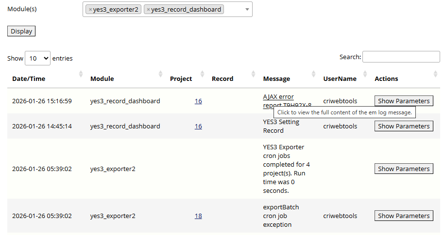
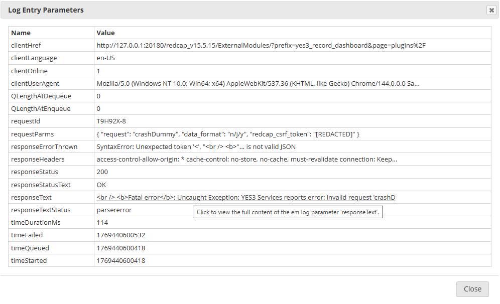
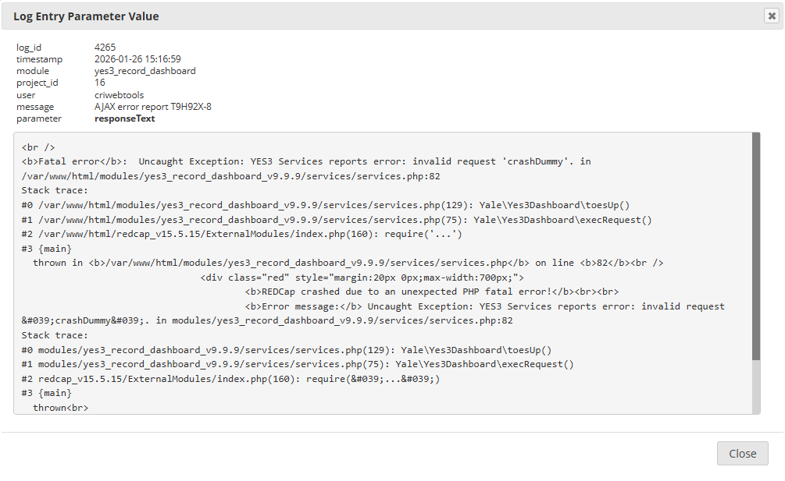

# The YES3 EM Log Parameter Viewer  

## The Problem

REDCap's built in EM Log browser is very powerful, but it may truncate the displayed value of the EM Log Message, or the value of an EM Log Parameter. This is reasonable since these values can be extremely large. However, there are times when viewing the full content is desirable.

## Our Solution

YES3 EM Log Parameter Viewer enhances REDCap's built-in EM Log browser by allowing you to display the full content of the log message, and of any em log parameter.

## Getting started  

After the EM is installed, it will be available on the Control Center ```view logs``` link, for use by REDCap Admins. The EM may also be enabled for any project, for use by REDCap Project staff.

### Required permissions

You must have permissions sufficient to manage external modules to access this EM. For Control Center access the required administrator permission is "Install, upgrade and configure External Modules". For project access, design permission is required.

## How to view truncated EM Log content  

Open the 'View Logs' link on the **External Modules** panel, either on the Control Center page or on a project page for which the EM has been enabled. You will see a screen like the one shown below. If you hover over a cell in the 'Message' column, you will see that it has become a link, with the tooltip title *Click to view the full content of the em log message* (Screen shot 1). Click on the link to display a dialog that includes the entire message content, in a scrolling container.

### Displaying the full content of a truncated EM Log Message

To view the full content of an EM Log Message, click on any cell in the EM Log View ```Message``` column. 

### Displaying the full content of a truncated EM Log Message Parameter  

Click on any ```Show Parameters``` button to open a ```Log Entry Parameters``` dialog, on which are displayed the names and (possibly truncated) values of parameters associated with the selected EM Log Record (Screen shot 2). Each EM Log Parameter value is a clickable link, that will open a dialog that includes the full content of the EM Log Parameter value (Screen shot 3). If the value is a JSON string, it will be formatted ('pretty printed') for easier interpretation.  

Peter Charpentier, 28 January 2026.  

Screen shot 1. The REDCap EM Log View user interface with clickable Message link.  

   
  
Screen shot 2. The REDCap EM Log Entry Parameters user interface with clickable Parameter Value link.    



Screen shot 3. The full content of an EM Log Parameter Value.  

    

